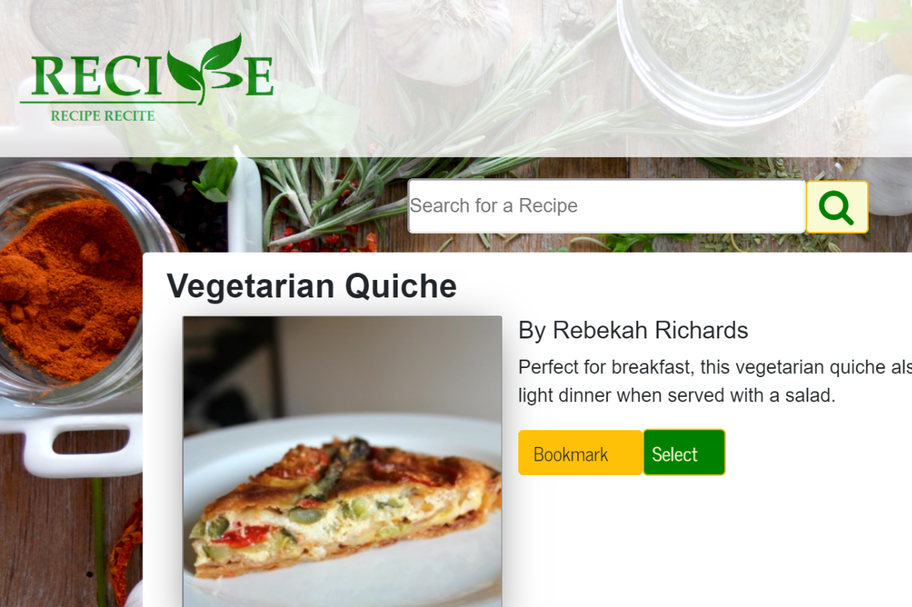
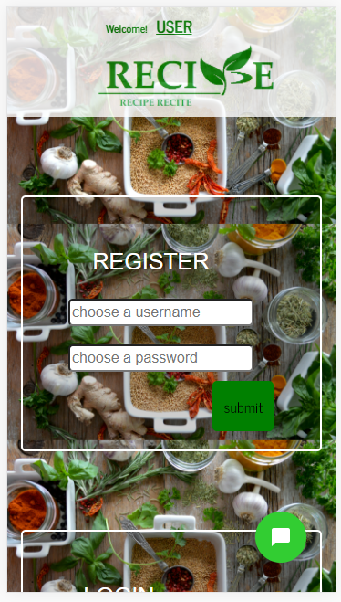

# Recipe Recite 
**Access the live site** [Here](#)

#### Utilize text to speech Cloud API to recite recipes out loud to the users while they are cooking in the kitchen. Simple voice commands inputs include ‘pause’, ‘play’ and ‘stop’. The app scrapes information from https://www.allrecipes.com. 

## Technologies and Libraries

* ReactJS
* Webpack
* Bootstrap
* MongoDB
* Text to Speech API
* Speech to Text API
* Chatbot
* Cheerio
* HTML
* CSS

      

---

## Mobile Responsiveness

 

---
## Authors
* **Tiffany Lin**         [Tiffolin](https://github.com/Tiffolin)
* **Kevin Tang**          [Kevin Tang](https://github.com/Saigonomai)
* **Sarah Sakhri**        [Sarah Sakhri](https://github.com/sarahsakhri)
* **Kai-Ann Fletcher**    [Kai-Ann Fletcher](https://github.com/KaiAnnFletcher)
* **David Ma**            [David Ma](https://github.com/david-fetchopia)
## License
MIT